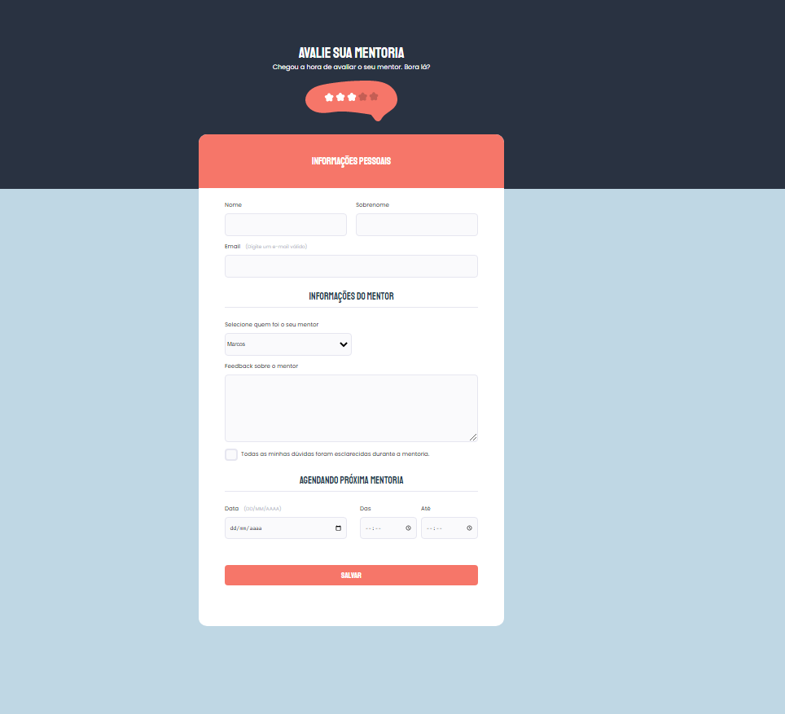

#  Desafio Formulario Avançado

> Programa  Explorer 

Projeto construido No stage 02 Programa Explorer  da Rocketseat.

👉🏼[Clique aqui para accessar](https://formulario-avancado.netlify.app/)

##  🔧 Tecnologias

- Html 
- Css
- Git e Github

##  🖥️ O que aprendi Nesse Desafio

Foi construido um pouco mais complicado construir esse site ainda tem algumas melhoras a serem feitas mas foi seguido conforme o figma 

## Contato 💻🧑‍💻 

juniorjose1925@gmail.com

https://www.linkedin.com/in/jose-martinez-352032222/
